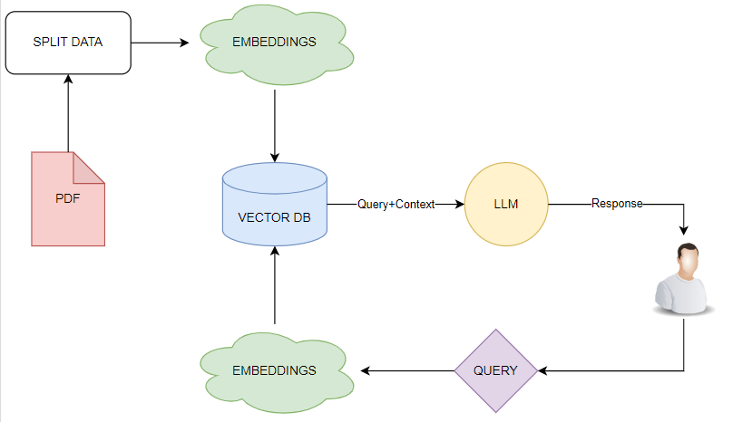
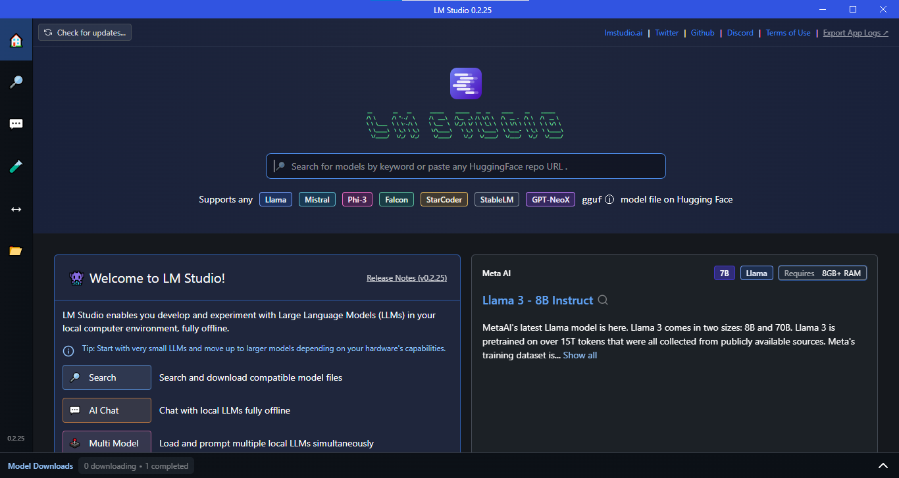
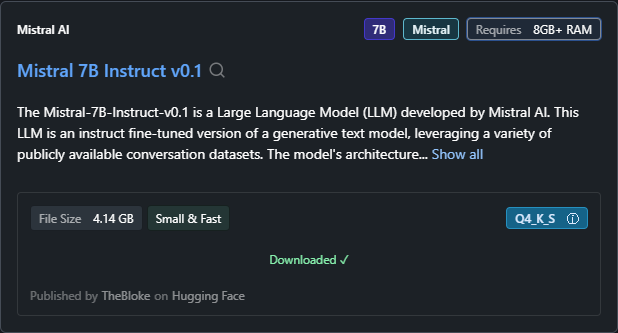
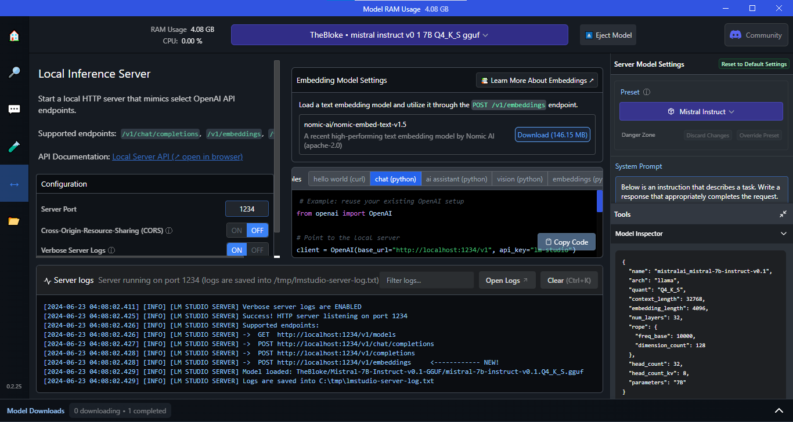
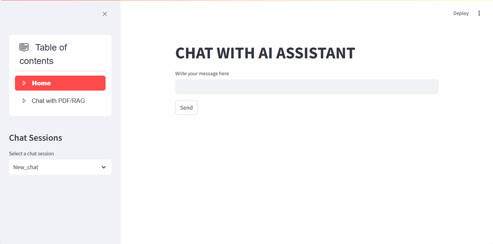
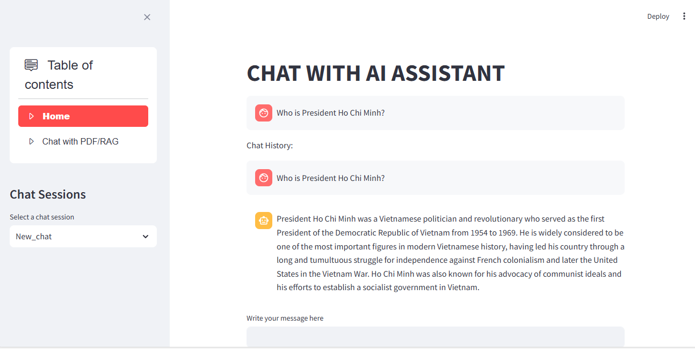
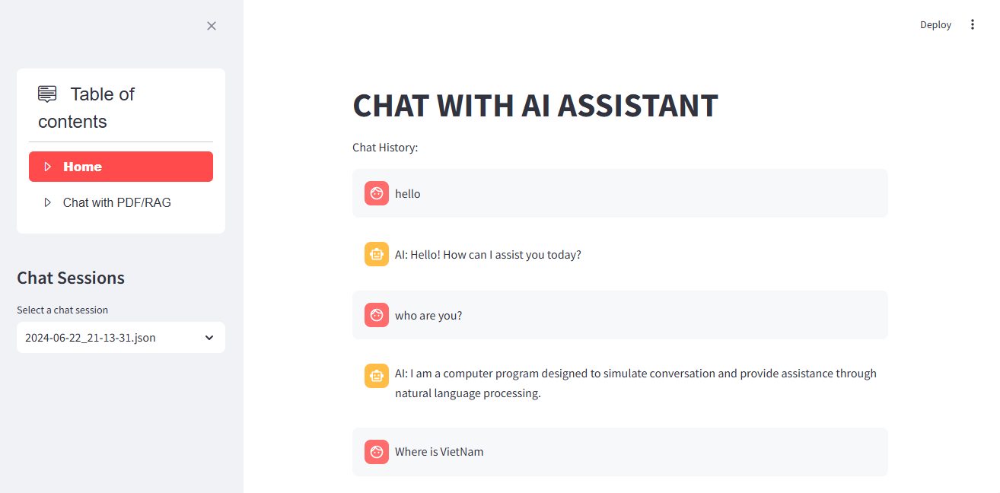
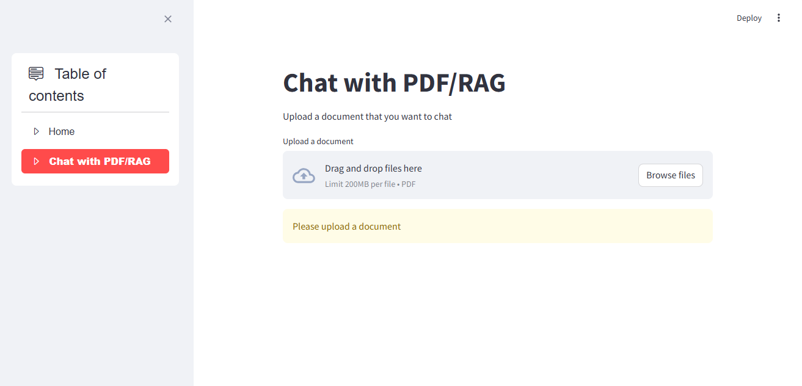
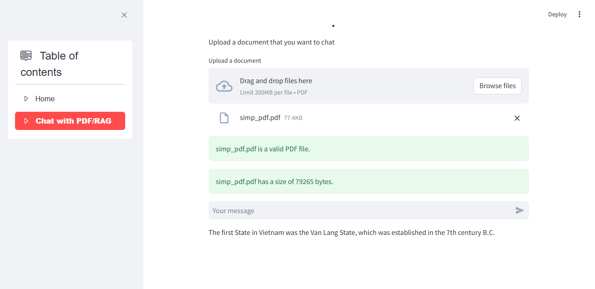

# CHATBOT-RAG

CHATBOT-RAG is a project aimed at developing intelligent chatbots capable of conversing and performing automated tasks. The project consists of two main chatbots:

1. **Basic Chatbot**: This chatbot can answer frequently asked questions and perform automated tasks based on predefined programming rules.
2. **Document-based Chatbot**: This advanced chatbot is capable of conversing about information extracted from user-provided documents, typically in PDF format. It utilizes AI technology and natural language processing to understand and extract information from the documents, enabling it to answer specific questions related to the content of the documents.

## Table of Contents

- [CHATBOT-RAG](#chatbot-rag)
  - [Table of Contents](#table-of-contents)
  - [Introduction](#introduction)
  - [Features](#features)
  - [Installation](#installation)
  - [Using the LM Studio](#using-the-lm-studio)
  - [Run the CHATBOT-RAG](#run-the-chatbot-rag)
  - [Video demo](#video-demo)
  - [References](#references)


## Introduction

This project combines the power of with [Streamlit](https://discuss.streamlit.io/) , [FAISS](https://www.pinecone.io/learn/series/faiss/faiss-tutorial/), [LangChain](https://python.langchain.com/docs/get_started/introduction.html) and [LM Studio](https://lmstudio.ai/) to build:
* Chatbot (ChatGPT like experience).
* RAG ChatBot with documents/PDF.

The RAG Chatbot operates by ingesting a collection of PDF files and, upon receiving a question, delivers an answer derived from the context within those files.



The Memory Builder component processes PDFs from the docs folder, breaking them into sections and calculating their embeddings with the all-MiniLM-L6-v2 transformer, then storing them in a FAISS vector database. When a user poses a question, the RAG ChatBot fetches relevant sections from the embedding database. Then it generates the final answer with a local LLM. Additionally, the chatbot remembers past interactions, using chat history and context from previous conversations to enhance its responses.

## Features
* Chatbot: This chatbot features capabilities similar to ChatGPT, enabling users to engage in natural conversations and receive intelligent responses based on artificial intelligence. It can understand and respond to a wide range of content, from simple queries to complex discussions.
* Chat with documents/PDF: The app is designed to cater to both professional and academic needs. It enables users to interact with their own PDF files locally on their device. By harnessing AI capabilities, the app can comprehend and interact with the content within these documents. This functionality allows users to extract insights, generate summaries, and engage in meaningful dialogue with the text contained in their PDF files. Overall, it serves as a valuable tool for personal use, empowering individuals to interact intelligently with their PDFs and derive meaningful information from them.


## Installation
To install clone the repository and follow these simple steps:
1. **Virtual Environment**: Python 3.12.3
2. **Install Requirements**: ```pip install -r requirements.txt```
3. **Download LM Studio suitable for your device**: ```https://lmstudio.ai/```
4. **Use the PDF file**: You can use the PDF document in the data directory. Alternatively, if you want to use another PDF file, please move that PDF file into the data directory of CHATBOT-RAG.
5. **Enter commands in terminal to interact with a GUI**:
   ```sh
   streamlit run .\Streamlit_RAG.py
   ```

## Using the LM Studio
LM Studio supports the use of the following models such as:
* Hugging Face Transformers
* OpenAI GPT Models
* Custom Models
* Pre-trained Models
* ONNX Models
* TensorFlow and PyTorch Models

To use LM Studio for CHATBOT-RAG, follow these steps:
1. **Step1**: After downloading LM Studio to your computer, open the interface

   
2. **Step2**: Click ```Download``` this Model and wait for it

   
3. **Step3**: Then, select ```Local Server``` in the left register. In ```Select a model to load```, select the model you just loaded. Once loaded, this is the interface:

   

In this way, you have completed installing LM Studio and the model to run CHATBOT-RAG.

Before proceeding, please obtain the ```base_url``` and ```base_url``` from LM Studio on your computer and replace .`\Streamlit_RAG` as follows:

```sh
# Fetch base_url from LM Studio
  llm = ChatOpenAI(base_url="<YOUR-BASE-URL>", api_key="<YOUR-API-KEY>")
```

## Run the CHATBOT-RAG
* Interface of Chatbot:

  
* Chatbot activities:

  
* Chat session history June 22, 2024 at 21:13:31:

  
* Interface of Chatbot RAG:

  
* Chatbot RAG's behavior when uploading a PDF file:

  
  Here is a piece of content containing the answer to the question "What was the first State in Vietnam" in the uploaded PDF file:
  
  

## References
* [Connecting the model from LM Studio](https://www.youtube.com/watch?v=olscAhDZFLM)
* [Chatbot Development](https://github.com/Leon-Sander/local_multimodal_ai_chat/tree/main)